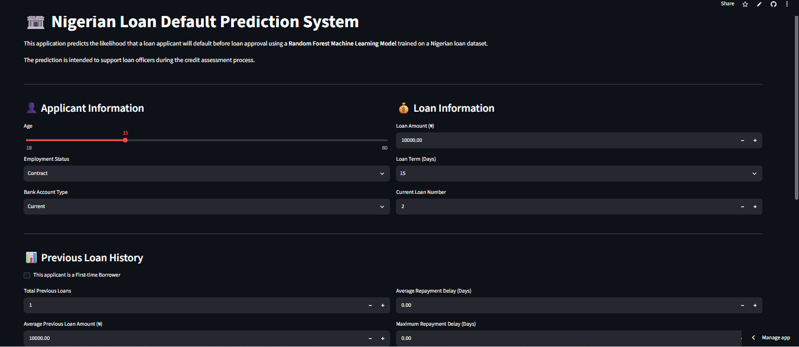

# 🏦 Nigerian Loan Default Prediction System

A Machine Learning-based web application that predicts the likelihood of loan default for Nigerian loan applicants using a **Random Forest Classifier** and presents the prediction results through an interactive **Streamlit** interface.

---

# Live Demo

**Web Application**

https://nigerian-loan-default-prediction-system-6r5pqfcoxewgssrpfbw4bn.streamlit.app/


# Application Preview

## Home Page



---

## Low Risk Prediction


---

## Moderate Risk Prediction


---

## High Risk Prediction


---

# Project Overview

This project presents a Machine Learning-based decision support system developed to predict the likelihood of loan default before loan approval. The system assists financial institutions in evaluating loan applications by estimating the probability that an applicant will repay or default on a loan based on historical lending data and applicant information.

The application predicts the probability of default and categorizes applicants into one of three risk levels:

- 🟢 Low Risk
- 🟡 Moderate Risk
- 🔴 High Risk

The prediction is generated using a trained **Random Forest Classifier**, while the risk category is determined using predefined probability thresholds.

---

# Features

- Interactive Streamlit web application
- Nigerian loan default prediction
- Loan repayment probability estimation
- Default probability estimation
- Automatic risk classification
- Applicant summary display
- Lending recommendation
- Clean and user-friendly interface
- First-time borrower support with automatic loan history handling

---

# Machine Learning Model

### Selected Model

- **Random Forest Classifier**

### Models Evaluated

- Logistic Regression
- Decision Tree
- Random Forest
- K-Nearest Neighbors (KNN)
- Support Vector Machine (SVM)
- Naïve Bayes
- XGBoost

The final model was selected after comparing the performance of multiple supervised machine learning algorithms using classification metrics such as:

- Accuracy
- Precision
- Recall
- F1-Score

The Random Forest model provided the most suitable balance between predictive performance and robustness for the Nigerian loan dataset.

---

# Dataset

The project utilizes a Nigerian loan dataset containing historical borrower information and repayment records.

### Features Used

Applicant Information

- Age
- Employment Status
- Bank Account Type

Loan Information

- Loan Amount
- Loan Term (Days)
- Current Loan Number

Previous Loan History

- Total Previous Loans
- Average Previous Loan Amount
- Maximum Previous Loan Amount
- Average Previous Loan Term
- Average Repayment Delay
- Maximum Repayment Delay
- Late Payment Rate

---

# Risk Classification

The application classifies applicants using the predicted probability of default.

| Default Probability | Risk Level |
|--------------------|------------|
| Less than 30% | 🟢 Low Risk |
| 30% – 59% | 🟡 Moderate Risk |
| 60% and above | 🔴 High Risk |

Each prediction is accompanied by:

- Repayment Probability
- Default Probability
- Risk Level
- Lending Recommendation

---

# Technologies Used

- Python
- Streamlit
- Pandas
- NumPy
- Scikit-learn
- Joblib

---

# Project Structure

```
nigerian-loan-default-prediction-system/
│
├── LoanDefaultApp.py
├── best_model.pkl
├── scaler.pkl
├── columns.pkl
├── label_encoders.pkl
├── requirements.txt
├── README.md
└── images/
    ├── home_page.png
    ├── low_risk_result.png
    ├── moderate_risk_result.png
    └── high_risk_result.png
```

---

# Installation

Clone the repository:

```bash
git clone https://github.com/YOUR_USERNAME/nigerian-loan-default-prediction-system.git
```

Move into the project folder:

```bash
cd nigerian-loan-default-prediction-system
```

Install the required dependencies:

```bash
pip install -r requirements.txt
```

Run the application:

```bash
streamlit run LoanDefaultApp.py
```

---

# How the System Works

1. The user enters applicant and loan information.
2. Categorical variables are converted using Label Encoding.
3. Numerical features are standardized using a saved StandardScaler.
4. The processed data is passed to the trained Random Forest model.
5. The model predicts the probability of default.
6. The application classifies the applicant as:
   - Low Risk
   - Moderate Risk
   - High Risk
7. The system displays:
   - Repayment Probability
   - Default Probability
   - Risk Assessment
   - Lending Recommendation
   - Applicant Summary

---

# Future Improvements

- Integration with real-time banking databases
- Explainable AI using SHAP or LIME
- Loan application history management
- User authentication and role-based access
- REST API deployment
- Cloud database integration
- Mobile-friendly interface
- Continuous model retraining with new loan records

---

# Academic Information

This application was developed as an undergraduate **Final Year Project** in Computer Engineering.

**Project Title**

**Machine Learning-Based Loan Default Prediction System for Nigerian Lending Institutions**

The project demonstrates the application of supervised machine learning techniques to support credit risk assessment and improve lending decisions through intelligent prediction of loan default.
